# ail-homework
The homework for my Artificial Intelligence Laboratory course.  
  
This [repository](https://github.com/dobosipeter/ail-homework/tree/main) contains my homework submission for my [Artificial Intelligence Laboratory](https://moodle.uni-pannon.hu/course/view.php?id=24556) course.
  
## Description  
  
I have received the following instructions to complete as the homework:  
* Make use of a Large Language Model in a complex way, utilizing programming and some form of data transformation.  
  
Additional guidance I've received:  
Don't just prompt a model, then simply pass its output into another model. Do some form of transformation on it first. The submission should implement some more complex functionality. Utilizing multiple modalities is also encouraged.  
  
I will have to present my results, which can be just running and explaining the code, or a presentation accompanied by a recording. (_Recommended in the case of longer runtimes._)  
I will have to transfer useful knowledge and call out the pitfalls I've encountered.
  
## My idea  
  
My idea is to implement a __Video Content Analysis__ solution.  
  
### Motivation  
As part of my course, I often review recorded lesson of various classes. However they often don't utilize the built in transcription features, which I've found to be surprisingly useful, when attempting to quickly skim through a lesson in order to find information on a specific topic.  
  
Additionally, the efficency of information retrieval, learning could potentially be increased by utilizing a Large Language Model at the end of this pipeline to help with answering questions about the topic.  
  
The outline of my solution is described as follows:

1.  **Ingestion**: Take a video file as input, extract audio (FLAC), split it into chunks to respect API limits, and transcribe it using OpenAI Whisper to generate a timestamped transcript. (Video -> Raw Text)
2.  **Semantic Segmentation**: Pass the transcript to a specialized LLM (GPT-4.1-mini) to simultaneously segment it into logical chapters and generate a summary + keywords for each section. (Raw Text -> Structured Chapters)
3.  **Knowledge Base Construction**: Embed the chapter summaries and keywords using OpenAI Embeddings and store them in a local FAISS vector database organized by "Collection". (Structured Data -> Vector Index)
4.  **Retrieval Augmented Generation (RAG)**: When the user asks a question, retrieve the relevant chapters, fetch the *original raw text* associated with them, and pass it to an LLM to generate an accurate, cited answer. (Query -> Context -> Answer)
  
## Architecture  

```mermaid
flowchart TD
    %% Global Styles
    classDef storage fill:#e1f5fe,stroke:#01579b,stroke-width:2px;
    classDef process fill:#fff9c4,stroke:#fbc02d,stroke-width:2px;
    classDef ai fill:#e8f5e9,stroke:#2e7d32,stroke-width:2px,stroke-dasharray: 5 5;
    classDef user fill:#fce4ec,stroke:#880e4f,stroke-width:2px;

    %% Nodes
    User([👤 User]):::user
    VideoFile[🎥 Video File]:::storage
    
    subgraph Phase1 [Phase 1: Ingestion]
        direction TB
        Extract[FFmpeg Extraction]:::process
        Split[Audio Splitting]:::process
        Whisper(OpenAI Whisper API):::ai
        Transcript[📝 Raw Transcript + Timestamps]:::storage
    end

    subgraph Phase2 [Phase 2: Semantic Analysis]
        direction TB
        Inject[Inject Time Anchors]:::process
        SegmentLLM(GPT-4.1-mini \n Segmentation):::ai
        Chapters[📚 Structured Chapters \n Title, Summary, Keywords]:::storage
    end

    subgraph Phase3 [Phase 3: Knowledge Base]
        direction TB
        Embed(OpenAI Embeddings):::ai
        FAISS[(FAISS Vector DB \n Organized by Collection)]:::storage
    end

    subgraph Phase4 [Phase 4: RAG & Chat]
        direction TB
        Query[❓ User Query]:::user
        Search[Similarity Search]:::process
        Context[📄 Raw Text Reconstruction]:::process
        AnswerLLM(GPT-4.1-mini \n Answer Generation):::ai
        FinalAnswer[💬 Final Answer \n with Citations]:::user
    end

    %% Flow Connections
    User -->|Uploads| VideoFile
    VideoFile --> Extract
    Extract -->|FLAC Audio| Split
    Split -->|10m Chunks| Whisper
    Whisper --> Transcript
    
    Transcript --> Inject
    Inject --> SegmentLLM
    SegmentLLM --> Chapters
    
    Chapters --> Embed
    Embed --> FAISS
    
    User -->|Asks Question| Query
    Query --> Search
    Search <-->|Retrieves Top K| FAISS
    Search -->|Metadata| Context
    Transcript -.->|Source Text| Context
    
    Context --> AnswerLLM
    Query --> AnswerLLM
    AnswerLLM --> FinalAnswer
```
  

